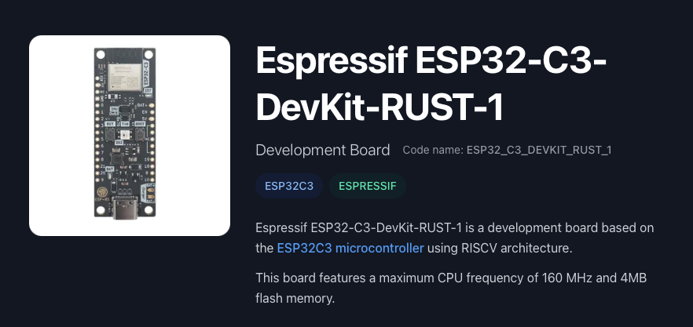

# Rust Embedded desde Cero

## paso-07-time-sync

[](https://github.com/FMFigueroa/paso-07-time-sync/actions/workflows/rust_ci.yml)

<p align="center">
  
</p>

SNTP + POSIX time bindings. El device se sincroniza con `pool.ntp.org` después de conectar a WiFi y expone helpers para leer la hora local (zona horaria `UTC+3`, ajustable). Es el preparatorio imprescindible para paso-08 (scheduler por hora del día).

## Pre-Requisitos

Los mismos de paso-06.

## Estructura nueva

```
src/time_sync.rs     # init_ntp() + get_current_hm() + get_local_time_string()
```

## Zona horaria

Default: `UTC+3` (Argentina estándar — sin horario de verano). Cambiá la constante `POSIX_TZ` en `src/time_sync.rs` si necesitás otra zona.

Formato POSIX TZ: `<ABBR><OFFSET>` donde el offset está **invertido** respecto al UTC habitual. UTC-3 se escribe "UTC+3" en POSIX.

## Compilar y flashear

```bash
cargo clean            # Recomendado — sdkconfig cambió (SNTP flags)
cargo espflash flash --release --monitor
```

En el primer log vas a ver `[2026-04-23 19:32:15] Telemetry: ...` si SNTP sincronizó. Si no tenés NTP accesible (red restringida), el log dirá `[no-time]` y el firmware sigue funcionando — degradación graceful.

## Roadmap

> Este repo es el **Paso 7** del curso **Rust Embedded desde Cero**.

- [Paso 1 — Scaffold del proyecto](https://github.com/FMFigueroa/paso-01-scaffold)
- [Paso 2 — WiFi Station](https://github.com/FMFigueroa/paso-02-wifi-station)
- [Paso 3 — LED PWM](https://github.com/FMFigueroa/paso-03-led-pwm)
- [Paso 4 — WebSocket Client](https://github.com/FMFigueroa/paso-04-websocket)
- [Paso 5 — Light State Management](https://github.com/FMFigueroa/paso-05-light-state)
- [Paso 6 — Telemetria](https://github.com/FMFigueroa/paso-06-telemetry)
- **[Paso 7 — Time Sync (SNTP)](https://github.com/FMFigueroa/paso-07-time-sync)** ← _este repo_
- [Paso 8 — Schedule & Auto Mode](https://github.com/FMFigueroa/paso-08-schedule)
- [Paso 9 — Concurrencia & Watchdog](https://github.com/FMFigueroa/paso-09-watchdog)


## Documentacion

<a href="https://discord.gg/dYrqe9HZfz"><strong>Unirse al servidor — Curso Rust Embedded</strong></a>

## Licencia

[MIT](LICENSE)
